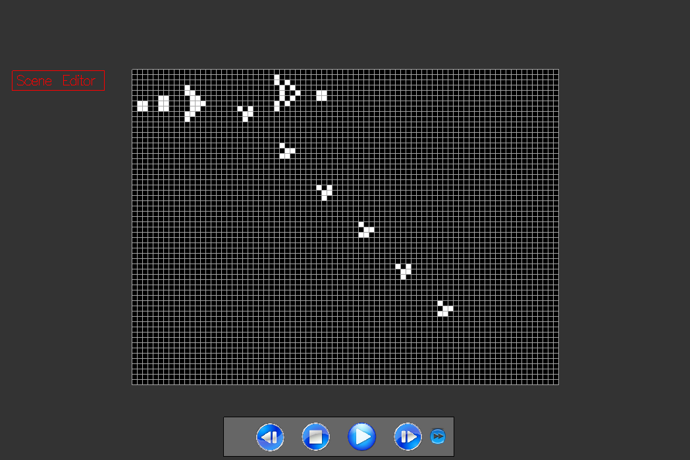

# conway-life



[](https://travis-ci.org/cmc-haskell-2016/conway-life)

## Установка и запуск

Для установки клонируйте репозиторий и соберите проект с помощью `stack`:

```
git clone https://github.com/cmc-haskell-2016/conway-life.git
cd conway-life
stack setup
stack build
```

После установки запуск осуществляется командой `stack exec`:

```
stack exec conway-life
```

Во время разработки инициировать повторную сборку проекта с последующим запуском рекомендуется
следующей командой:

```
stack build && stack exec conway-life
```
